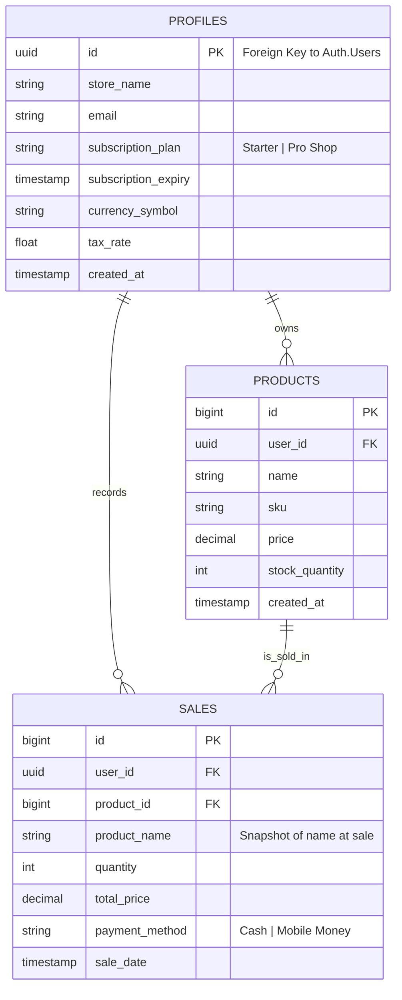

# StockFlow: Technical Documentation & System Design

**Student Name:** [Your Name]  
**Project Title:** Design and Implementation of a Cloud-Based Inventory Management & POS System for SMEs  
**Date:** December 8, 2025

---

## 1. Executive Summary
StockFlow is a comprehensive SaaS (Software as a Service) application designed to digitize retail operations for Small and Medium Enterprises (SMEs). It addresses critical business challenges such as inventory tracking, sales recording, and business continuity in low-connectivity environments. The system leverages modern web technologies to provide a seamless, responsive, and secure user experience across desktop and mobile devices.

---

## 2. System Architecture

The system follows a **Client-Server Architecture** utilizing a "Backend-as-a-Service" (BaaS) model with Supabase.

### 2.1 High-Level Architecture Diagram

```mermaid
graph TD
    Client[Client Layer<br/>(Next.js / React)]
    
    subgraph "Frontend Application"
        Auth[Auth Module]
        Inv[Inventory Module]
        POS[POS Module]
        Offline[Offline Sync Engine]
    end
    
    subgraph "Backend Services (Supabase)"
        AuthSvc[Authentication Service]
        DB[(PostgreSQL Database)]
        RLS[Row Level Security Policies]
    end
    
    Client -->|HTTPS / JSON| AuthSvc
    Client -->|Supabase Client| DB
    
    Auth --> AuthSvc
    Inv -->|Read/Write| DB
    POS -->|Write Sales| DB
    POS -->|Local Storage| Offline
    Offline -->|Sync when Online| DB
    
    RLS -.->|Enforces Access| DB
```

### 2.2 Technology Stack
*   **Frontend Framework:** Next.js 16 (React)
*   **Language:** TypeScript (Strict Type Safety)
*   **Styling:** Tailwind CSS (Utility-first CSS)
*   **Database:** PostgreSQL (via Supabase)
*   **Authentication:** Supabase Auth (JWT)
*   **State Management:** React Context API & Hooks
*   **Offline Storage:** Browser LocalStorage

---

## 3. Use Case Diagram

This diagram illustrates the interactions between the primary actors (Shop Owner) and the system's core functionalities.

```mermaid
usecaseDiagram
    actor "Shop Owner / Admin" as Admin
    
    package "StockFlow System" {
        usecase "Register / Login" as UC1
        usecase "Manage Inventory" as UC2
        usecase "Process Sale (POS)" as UC3
        usecase "View Analytics" as UC4
        usecase "Manage Subscription" as UC5
        usecase "Offline Mode" as UC6
        usecase "Generate Receipts" as UC7
    }
    
    Admin --> UC1
    Admin --> UC2
    Admin --> UC3
    Admin --> UC4
    Admin --> UC5
    
    UC2 ..> "Add Product" : include
    UC2 ..> "Edit/Delete Product" : include
    UC2 ..> "Low Stock Alerts" : extend
    
    UC3 ..> "Calculate Tax" : include
    UC3 ..> "Update Stock Level" : include
    UC3 --> UC7
    
    UC3 <.. UC6 : extends (if internet fails)
```

---

## 4. Entity Relationship (ER) Diagram

The database schema is normalized to ensure data integrity. **Row Level Security (RLS)** is applied to all tables to ensure multi-tenancy isolation (User A cannot see User B's data).



### 4.1 Database Schema Details

#### Table: `profiles`
Stores user-specific settings and subscription status.
*   **Primary Key:** `id` (Linked to Supabase Auth User ID)
*   **Key Columns:** `store_name`, `subscription_plan`, `subscription_expiry`.

#### Table: `products`
Stores the inventory catalog.
*   **Foreign Key:** `user_id` (Links to `profiles.id`)
*   **Constraint:** `stock_quantity` must be >= 0.

#### Table: `sales`
Stores transaction history.
*   **Foreign Key:** `user_id` (Links to `profiles.id`)
*   **Design Note:** `product_name` is stored redundantly to preserve historical accuracy even if the original product is renamed or deleted.

---

## 5. Key Algorithms & Logic

### 5.1 Offline Synchronization Algorithm
To ensure business continuity during network outages, the system implements an Optimistic UI pattern with a "Store-and-Forward" mechanism.

1.  **Detection:** The app listens for browser `offline` and `online` events.
2.  **Capture:** When offline, sales data is serialized to JSON and stored in `localStorage` under the key `offline_sales_queue`.
3.  **Queueing:** New offline sales are appended to this array.
4.  **Synchronization:**
    *   When the `online` event fires, the `syncOfflineSales()` function is triggered.
    *   It iterates through the queue and attempts to `POST` each sale to Supabase.
    *   **Success:** The item is removed from the queue.
    *   **Failure:** The item remains in the queue for the next retry.

### 5.2 Subscription Enforcement Logic
The system enforces a "Soft Lock" mechanism for expired subscriptions.

1.  **Check:** On every page load (via `layout.tsx`), the system compares `subscription_expiry` with `Date.now()`.
2.  **State:** If `expiry < now`, the global state `isExpired` is set to `true`.
3.  **Enforcement:**
    *   **UI:** A red banner appears.
    *   **Functional:** Buttons for `Add Product`, `Checkout`, and `Delete` are programmatically disabled.
    *   **Data Access:** Read access remains enabled (User can view data), but Write access is blocked at the UI level.

---

## 6. Security Implementation

### 6.1 Authentication
*   Managed via Supabase Auth (JWT Tokens).
*   Passwords are hashed and salted (never stored in plain text).

### 6.2 Authorization (Row Level Security)
PostgreSQL policies enforce data isolation at the database engine level.
*   **Policy:** `CREATE POLICY "Users can view own products" ON products FOR SELECT USING (auth.uid() = user_id);`
*   **Effect:** Even if a malicious user attempts to query all products via the API, the database will only return rows belonging to their authenticated ID.

---

## 7. Future Enhancements
*   **Mobile Application:** Development of a React Native wrapper for app store distribution.
*   **Barcode Scanning:** Integration of the device camera for SKU scanning.
*   **Multi-User Roles:** Adding 'Manager' and 'Cashier' roles with granular permissions.
